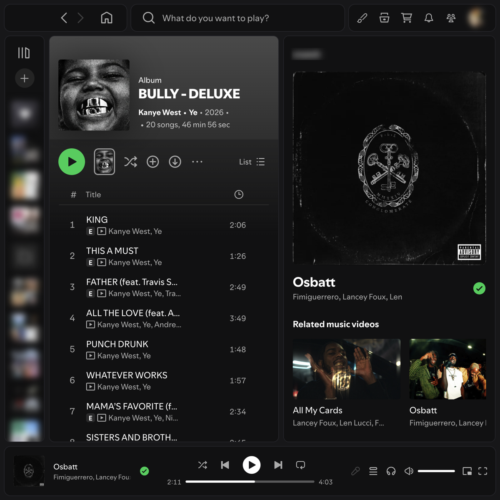

# Subtle Outline

Just a subtle dark theme that used Simple Outline as a base. It was changed to better fit macOS and to tidy up the top bar.



## Features

- **Boxed top bar**: back, forward and Home in one box; a full-width search bar in the middle; settings, Browse, Marketplace, What's New, Listening activity and your profile on the right.
- **Room for the window buttons**: on the left on Mac, top right on Windows.
- **Settings panel** (paintbrush icon, top right), with every change applied instantly:
  - **Window buttons**: Mac / Windows
  - **Corners**: Rounded / Sharp (sharp squares off *everything*, buttons and tags included)
  - **Colour scheme**: switch between the schemes below without leaving Spotify
  - **Colours**: accent (play buttons and highlighted items), background, box background and outline
  - **Outline thickness**: 0–4px
  - **Switches**: boxed top bar, boxed search dropdown, compact search dropdown, plain search bar (no fill or glow), hide the ⌘L hint, flat top bar buttons (no hover circles; icons glow instead), dim Home icon, charcoal Liked Songs
  - **Reset to defaults**
- **Colour schemes** (all dark): Subtle (default), Midnight, Forest, Ember, Amethyst and Mono, plus Simple Outline's Natural and Droid.

## Install

Install **Subtle Outline** from the Themes tab in [Spicetify Marketplace](https://github.com/spicetify/marketplace). It's tagged "external JS" because it includes `subtle-outline.js`, which provides the top bar layout and the settings panel.

### Manual install

1. Copy `user.css` and `color.ini` into `~/.config/spicetify/Themes/Subtle Outline/` (on Windows: `%appdata%\spicetify\Themes\Subtle Outline\`).
2. Copy `subtle-outline.js` into `~/.config/spicetify/Extensions/`.
3. Run:
   ```
   spicetify config current_theme "Subtle Outline" color_scheme Subtle
   spicetify config extensions subtle-outline.js
   spicetify apply
   ```

## Notes

- Made and tested on **macOS**. The Windows window-button spacing is untested; please open an issue if it doesn't line up.
- Spotify updates sometimes rename the parts of the app this theme styles. If something breaks after an update, please open an issue.
- After a Spotify update wipes Spicetify, run `spicetify backup apply`. Your settings are kept.

## Credits

- **Simple Outline** by [Droidiar](https://github.com/Droidiar): the original outlined theme this is forked from (`user.css` and the Natural and Droid colour schemes).
- Subtle Outline changes and `subtle-outline.js` by [terminalsilliness](https://github.com/terminalsilliness).
